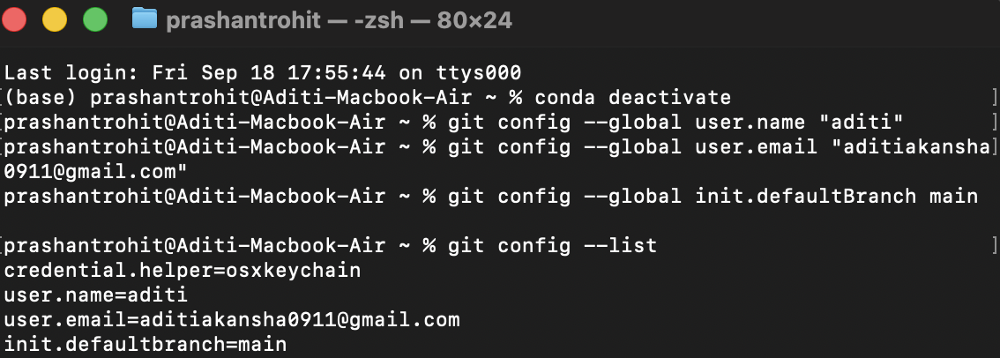
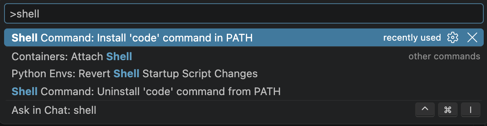

# Git & VS Code — Post-Installation Setup

> Complete this after you have installed Git, VS Code, and Python.  
> These steps are the same for Windows, macOS, and Linux unless noted.

---

## Table of Contents

1. [Configure Git](#1-configure-git)
2. [Set Up the `code` Command](#2-set-up-the-code-command)
3. [Install GitLens](#3-install-gitlens)
4. [Set VS Code as Git's Default Editor](#4-set-vs-code-as-gits-default-editor)
5. [Verify Everything](#5-verify-everything)

---

## 1. Configure Git

Git needs to know who you are before it can track your commits. Open your terminal (Git Bash on Windows, Terminal on macOS/Linux) and run these three commands one at a time, replacing the placeholder text with your actual name and email:

```bash
git config --global user.name "Your Name"
```
```bash
git config --global user.email "you@example.com"
```
```bash
git config --global init.defaultBranch main
```

> Use the same email you use (or plan to use) for your GitHub account — this is how GitHub links your commits to your profile.

Then verify it worked:

```bash
git config --list
```

You should see your `user.name`, `user.email`, and `init.defaultBranch` in the output.



> Note: You may also see `credential.helper=osxkeychain` on macOS — that is normal and was added automatically by your system.

---

## 2. Set Up the `code` Command

This lets you type `code .` in any terminal to open that folder instantly in VS Code.

**Windows**

The `code` command is added to PATH automatically during VS Code installation. Open Command Prompt or Git Bash and run:

```bash
code --version
```

If it works, you're done. If not, open VS Code, press `Ctrl + Shift + P`, type `shell command`, and select **"Shell Command: Install 'code' command in PATH"**. Restart your terminal.

**macOS / Linux**

1. Open VS Code
2. Press `Cmd + Shift + P` (macOS) or `Ctrl + Shift + P` (Linux)
3. Type `shell command`
4. Click **"Shell Command: Install 'code' command in PATH"**
5. Close your terminal completely and reopen it



Test it:

```bash
code --version
```

Then try opening a folder:

```bash
code .
```

---

## 3. Install GitLens

GitLens is a VS Code extension that shows Git history, inline blame, and branch activity directly in the editor.

1. Open VS Code
2. Click the Extensions icon in the left sidebar (or press `Ctrl + Shift + X`)
3. Search for **GitLens**
4. Click **Install**
5. If prompted to restart extensions, click **Restart Extensions**


After installation, the GitLens page in the marketplace should look like this:


You can also install GitLens directly from the terminal:

```bash
code --install-extension eamodio.gitlens
```

---

## 4. Set VS Code as Git's Default Editor

Run this after the `code` command is working:

```bash
git config --global core.editor "code --wait"
```

This means whenever Git needs you to write a commit message or resolve a conflict, it will open VS Code instead of the default terminal editor.

---

## 5. Verify Everything

Run these one by one and confirm each returns output:

```bash
git --version
git config --list
code --version
```

Your `git config --list` output should include:

```
user.name=Your Name
user.email=you@example.com
init.defaultbranch=main
core.editor=code --wait
```

If all of the above work and GitLens is visible in your Extensions sidebar, you are ready for the workshop.

---

> Questions? Drop a message in the workshop group before the session.
