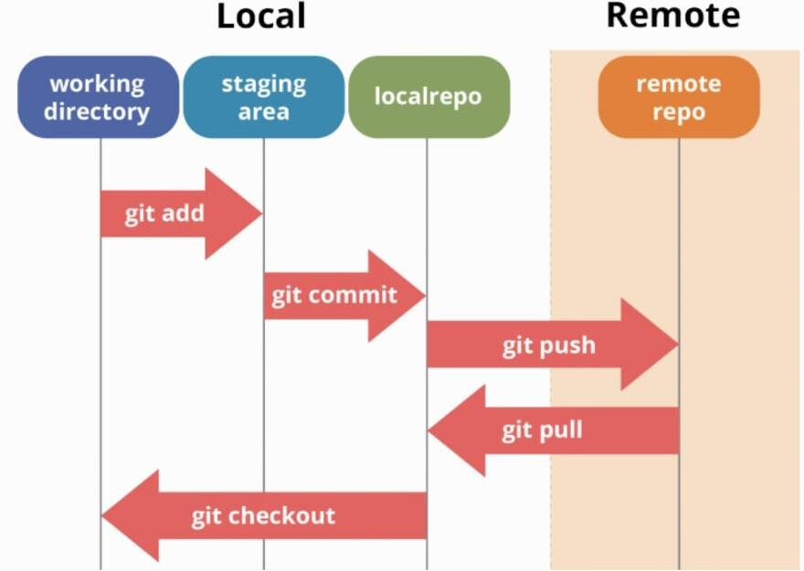

# Git Commands - The Basics

---

## What is Git?

Git is a version control system. It tracks every change you make to your files over time, so you can go back to any previous version, see what changed, and collaborate with others without overwriting each other's work.

Think of it like a detailed save history for your entire project, not just the last save, but every save you have ever made, with notes on what changed and why.

---

## What is GitHub?

GitHub is a website where you store your Git repositories online. Git lives on your computer. GitHub is the cloud backup and collaboration layer on top of it.

- Git = the tool that tracks changes locally
- GitHub = the platform where you share and collaborate on those changes

You use Git on your machine, then push your work to GitHub so others can see it, contribute to it, or you can access it from another device.


The analogy 

Git is like Microsoft Word on your computer — you write and save files locally.
GitHub is like Google Docs — it puts those files online so others can access, collaborate, and you have a backup in the cloud.
---

## Why Do You Need Git?

You are building a project. You write some code, it works. You keep going, add more features. At some point something breaks and you have no idea what you changed. You cannot go back. You start deleting things trying to fix it and make it worse.

Now imagine three people working on the same project. One person is editing the login page, another is changing the database. They both save their files and now half the code is overwritten and nobody knows whose version is right.

Git solves both of these problems.

- It keeps a complete history of every change ever made, so you can always go back
- It lets multiple people work on the same codebase at the same time without overwriting each other
- It tells you exactly what changed, when, and who changed it
- It lets you experiment on a separate branch without touching the working version


---

## The Commands

### `git init`

Initialises a new Git repository in the current folder. Creates a hidden `.git/` folder that Git uses to track everything. Run this once when you start a new project.

```bash
git init
```

---

### The File We Are Tracking - `calc.py`

Create a new file called `calc.py` and paste this in:

```python
# Simple Calculator

def add(a, b):
    return a + b

def subtract(a, b):
    return a - b

def multiply(a, b):
    return a * b

def divide(a, b):
    if b == 0:
        return "Error: Cannot divide by zero"
    return a / b

def calculator():
    print("===== Simple Calculator =====")
    print("Operations: add | subtract | multiply | divide")
    print("Type 'quit' to exit")
    print()

    while True:
        operation = input("Enter operation: ").strip().lower()

        if operation == "quit":
            print("Goodbye!")
            break

        if operation not in ["add", "subtract", "multiply", "divide"]:
            print("Invalid operation. Try again.\n")
            continue

        try:
            a = float(input("Enter first number: "))
            b = float(input("Enter second number: "))
        except ValueError:
            print("Please enter valid numbers.\n")
            continue

        if operation == "add":
            print(f"Result: {a} + {b} = {add(a, b)}\n")
        elif operation == "subtract":
            print(f"Result: {a} - {b} = {subtract(a, b)}\n")
        elif operation == "multiply":
            print(f"Result: {a} x {b} = {multiply(a, b)}\n")
        elif operation == "divide":
            print(f"Result: {a} / {b} = {divide(a, b)}\n")

calculator()
```

Save the file with `Cmd + S` (Mac) or `Ctrl + S` (Windows/Linux).

---

### `git status`

Shows the current state of your working directory. Run this constantly, before and after every other command.

```bash
git status
```


Reading this output:
- `On branch main` - you are on the main branch
- `No commits yet` - nothing has been saved yet
- `Untracked files: calc.py` in red - Git can see this file but is not tracking it yet

When you create a file, Git sees it but does not automatically start tracking it. A file that exists but has never been added to Git is called an **untracked file**. Once you run `git add` on it, Git starts tracking it from that point on.

---

### `git add <file>` and `git add .`

Moves a file from untracked into the staging area, ready to be committed.

```bash
git add calc.py
```

To stage everything in the current folder at once:

```bash
git add .
```

Staging is the step between making changes and saving them. When you run `git add` you are not committing yet, you are deciding what goes into your next commit. If you changed five files but only want to commit three, you stage just those three.

```
Working directory  ->  git add  ->  Staging area  ->  git commit  ->  Repository
```

After `git add calc.py`, running `git status` again shows the file in green under `Changes to be committed` - it is staged and ready.

---

### `git commit -m "message"`

Saves a snapshot of everything in the staging area. The message should briefly describe what changed.

Think of it like you work in a company if a piece of code you wrote or chnaged today needs to be understood by someone a year down the line they need to know what you changed and why?
A simple commit message does that.. It describes everything that was done before for someone new who joins the repo.

```bash
git commit -m "added calc.py"
```

Every commit gets a unique ID and records the author, date, and message. Write commit messages that explain what changed, not just "update" or "fix."


This diagram shows how your changes move from your working directory through staging, into your local repo, and eventually up to GitHub:



---

### `git log` and `git log --oneline`

Shows the full commit history of the repository, most recent first.

```bash
git log
```

For a compact view, one commit per line:

```bash
git log --oneline
```

`git log --oneline` collapses each commit to its short ID and message. `HEAD -> main` means this is the latest commit on the main branch.

---

## The Full Sequence

```bash
git init
git status
git add calc.py
git add .
git commit -m "added calc.py"
git status
git log --oneline
```
