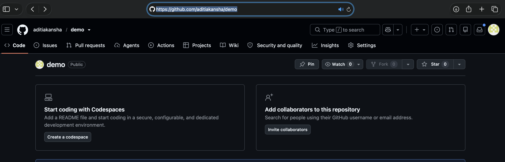
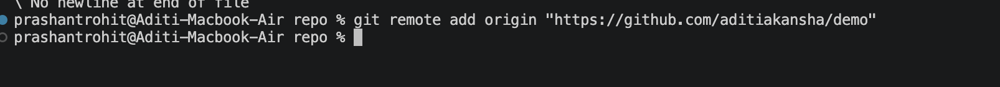
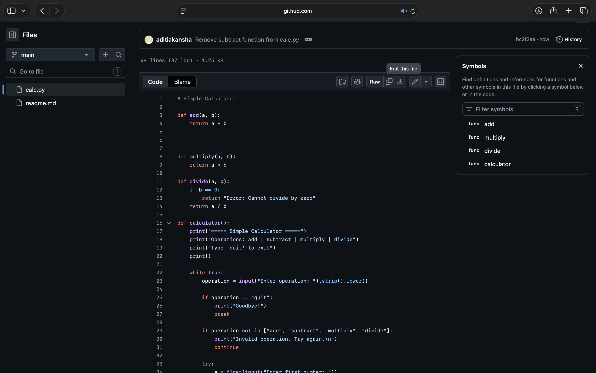

# GitHub — Pushing Your Code Online

At this point you have a local Git repository with at least one commit. This section covers how to put that code on GitHub so it lives on the internet and others (or you, from another machine) can access it.

---

## Step 1 — Create a GitHub Account

Go to [github.com](https://github.com) and click **Sign up**. You can sign up with your email or continue with Google.

# SSH Setup for GitHub

## Windows (PowerShell)

### Step 1 - Generate SSH Key
```powershell
ssh-keygen -t ed25519 -C "your@email.com" -f "$env:USERPROFILE\.ssh\github_ed25519"
```
Press Enter twice to skip the passphrase (or set one if you want).

### Step 2 - Copy the Public Key
```powershell
Get-Content "$env:USERPROFILE\.ssh\github_ed25519.pub" | Set-Clipboard
```

### Step 3 - Add Key to GitHub
1. Go to **GitHub > Settings > SSH and GPG keys**
2. Click **New SSH key**
3. Paste the key and save

### Step 4 - Test the Connection
```powershell
ssh -T -i "$env:USERPROFILE\.ssh\github_ed25519" git@github.com
```
You should see: `Hi username! You've successfully authenticated`

---

## Mac (Terminal)

### Step 1 - Generate SSH Key
```bash
ssh-keygen -t ed25519 -C "your@email.com" -f ~/.ssh/github_ed25519
```
Press Enter twice to skip the passphrase.

### Step 2 - Copy the Public Key
```bash
pbcopy < ~/.ssh/github_ed25519.pub
```

### Step 3 - Add Key to GitHub
1. Go to **GitHub > Settings > SSH and GPG keys**
2. Click **New SSH key**
3. Paste the key and save

### Step 4 - Test the Connection
```bash
ssh -T -i ~/.ssh/github_ed25519 git@github.com
```
You should see: `Hi username! You've successfully authenticated`


---

## Step 2 — Create a New Repository

A repository on GitHub is where your project lives online. Think of it as the cloud version of the folder on your laptop.


Fill in the details:

**Repository name** — keep it short and clear. No spaces — use hyphens instead (e.g. `my-project`).

**Description** — a one-line summary of what the project does. Optional, but worth filling in.

**Public vs Private**
- Public means anyone on the internet can view your code. Good for portfolios, open source projects, or anything you want to show.
- Private means only you and people you specifically invite can see it.

**Add README** — a README is a markdown file that shows up on your repo's homepage. It is the first thing anyone reads when they visit your project. Leave this off for now because you already have files locally — creating one here would cause a conflict when you try to push.

**Add .gitignore** — this file tells Git which files to never track. For example, a Python project would ignore files like `__pycache__/` or `.env`. Select the template matching your language.

**Add license** — a license tells other developers what they are legally allowed to do with your code. MIT is the most common choice for open source — it lets anyone use, copy, and modify your code as long as they give you credit.

Click **Create repository**.

---

## Step 3 — Connect Your Local Repo to GitHub

After creating the repo, GitHub shows an empty repository page.



Copy your repo URL from the browser address bar. It will look like:
`https://github.com/yourusername/reponame`

Go to your terminal and run:

```bash
git remote add origin "https://github.com/yourusername/reponame"
```



What this command does — it tells your local Git repo where on the internet to send your code. You are creating a named connection called `origin` that points to your GitHub URL. The name `origin` is just a convention — everyone uses it for their main remote, so stick with it.

To confirm the connection was set up correctly:

```bash
git remote -v
```

This shows you the URL your repo is connected to. If you see your GitHub link, you are good to go.

---

## Step 4 — Push Your Code to GitHub

```bash
git push -u origin main
```


This command sends all your local commits up to GitHub. Your files are now online.

**What does `-u` mean?**

The `-u` flag sets up a permanent link between your local `main` branch and the `main` branch on GitHub. You only need to type it on your very first push. After that, Git remembers the connection and you can just run:

```bash
git push
```

That is all you need from now on every time you want to send new changes up.

---

## Step 5 — See Your Files on GitHub

Refresh the GitHub page in your browser. Your files are now live.


---

## Step 6 — Edit a File Directly on GitHub

You can make changes to files right in the browser without going back to your terminal. This is useful for quick edits, and it also simulates what happens when a teammate makes a change that you do not have on your machine yet.

Click on `calc.py` in the file list, then click the pencil icon in the top right corner of the file view.

Delete the `subtract` function from the code, then scroll down and click **Commit changes**.



That change now exists on GitHub but not on your local machine. Your local `calc.py` still has the subtract function. This is exactly the situation `git fetch` and `git pull` are designed to handle.

---

## Step 7 — git fetch

`git fetch` checks GitHub for any new changes and downloads information about them — but it does not touch your local files. Nothing in your project changes yet. You are just asking Git to go look at what is new on GitHub and make a note of it.

```bash
git fetch
```

After running this, open the **Source Control** panel in VS Code by clicking the branch icon in the left sidebar. In the GitLens Graph at the bottom of that panel you will see two sections:

---

## Step 8 — git pull

`git pull` brings the changes from GitHub into your local machine and applies them. It is the combination of fetching and merging in a single step.

```bash
git pull
```

After this runs, open `calc.py` — the subtract function is gone. Your local file now matches what is on GitHub.

In the GitLens Graph, the incoming change has merged into your local branch. Both are now in sync.

**fetch vs pull — when to use which**

Use `git fetch` when you want to see what changed on GitHub before deciding what to do. Use `git pull` when you are ready to bring those changes into your local files. In day-to-day work, most people just run `git pull` directly.

---


```

This is the standard habit when working with others. Always pull before you push.


---

### `git stash`

Sometimes you are in the middle of a change and something else comes up — you need to switch branches, pull new code, or fix something urgent. But your work is half done and you are not ready to commit it. `git stash` takes all your uncommitted changes and puts them into a temporary pocket, leaving your working directory completely clean. When you are ready to come back, you bring them back out.

```bash
git status
```
We change something in the readme file or we simply add a comment in the calc.py

```bash
git stash
```

Your working directory is instantly clean. Any changes you made disappeared. The change is safely stored in the stash pocket.

```bash
git status
```

Nothing to commit, working tree clean. You can now safely switch branches or pull without your unfinished work getting in the way.

```bash
git stash pop
```

The comment comes back from the stash 

```bash
git stash list
```

Empty — because `git stash pop` already consumed it. If you want to show a non-empty stash list during the demo, run `git stash list` before `git stash pop`, not after.


---

## Quick Reference

| What you want to do | Command |
|---------------------|---------|
| Connect repo to GitHub | `git remote add origin <url>` |
| Check the connection | `git remote -v` |
| First push | `git push -u origin main` |
| Every push after | `git push` |
| See what changed on GitHub | `git fetch` |
| Bring GitHub changes to your machine | `git pull` |
| Save unfinished work temporarily | `git stash` |
