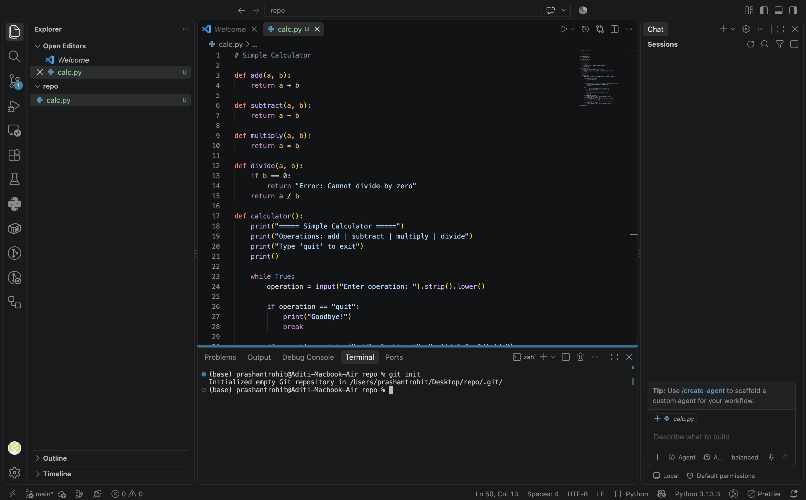
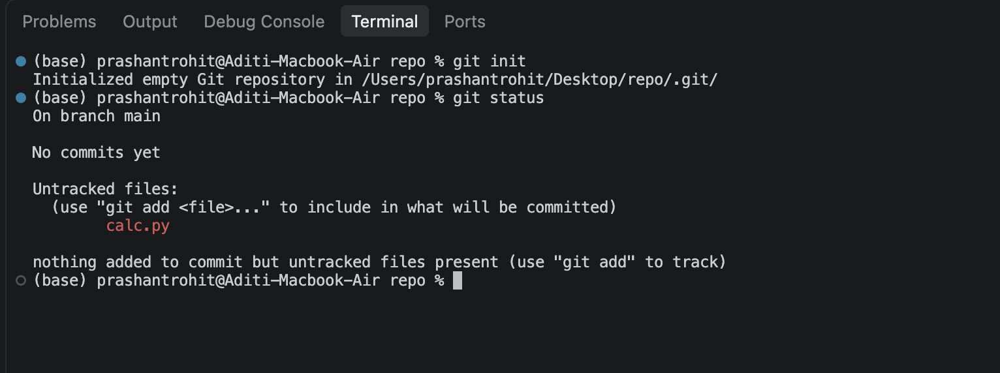
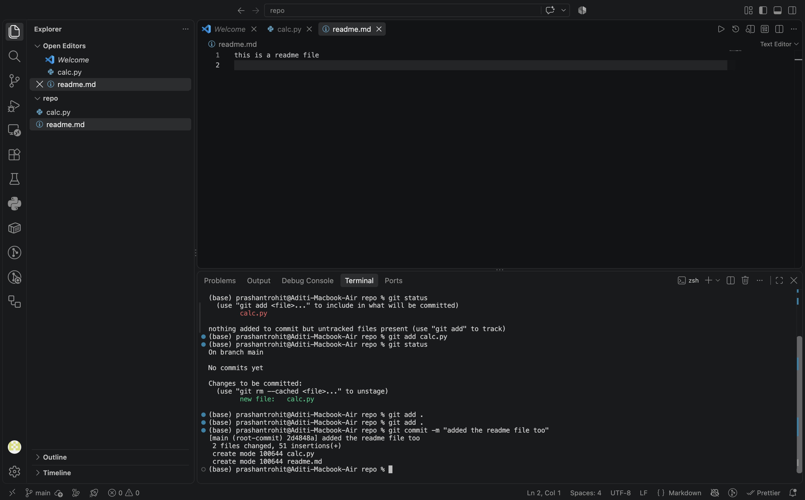
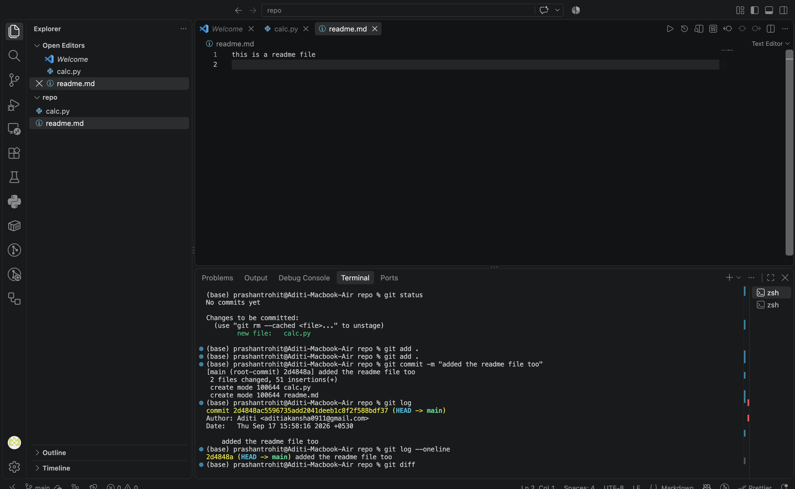
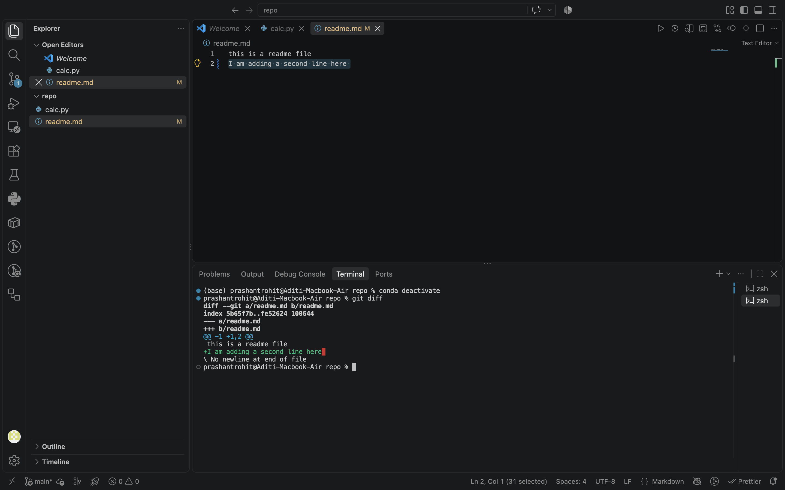

# Git Commands — The Basics

---

## What is Git?

Git is a version control system. It tracks every change you make to your files over time, so you can go back to any previous version, see what changed, and collaborate with others without overwriting each other's work.

Think of it like a detailed save history for your entire project — not just the last save, but every save you have ever made, with notes on what changed and why.

---

## What is GitHub?

GitHub is a website where you can store your Git repositories online. Git lives on your computer. GitHub is the cloud backup and collaboration layer on top of it.

- Git = the tool that tracks changes locally
- GitHub = the platform where you share and collaborate on those changes

You use Git on your machine, then push your work to GitHub so others can see it, contribute to it, or you can access it from another device.

---

## The Basic Git Flow

Every time you work on a project with Git, the flow looks like this:

```
Make changes to files
      ↓
git status        (see what changed)
      ↓
git add           (stage the changes you want to save)
      ↓
git commit        (save a snapshot with a message)
      ↓
git log           (review the history)
```

---

## What is the `main` Branch?

When you initialise a Git repository, Git creates a default branch called `main`. A branch is just a named timeline of commits. `main` is the primary one — it's where your stable, working code lives.

You will see `On branch main` in almost every `git status` output. This just means you are working on the main timeline of your project. Branches become important later when you start working on features or collaborating — for now, you will always be on `main`.

---

## What are Untracked Files?

When you create a file in a folder, Git sees it — but it does not automatically start tracking it. A file that exists in the folder but has never been added to Git is called an **untracked file**.

Git shows these in red in `git status`. It is telling you: "I can see this file exists, but I am not watching it yet."

Once you run `git add` on a file, Git starts tracking it. From that point on, Git will notice every change you make to it.

---

## What is Staging?

Staging is the step between making changes and saving them as a commit. When you run `git add`, you are not committing yet — you are placing files into a **staging area** (also called the index), which is a holding zone of "what will go into my next commit."

This gives you control. If you changed five files but only want to commit three of them, you stage just those three and leave the others out.

```
Working directory  →  git add  →  Staging area  →  git commit  →  Repository
   (your files)                   (ready to save)                  (saved snapshot)
```

---

## The Commands

### `git init`

Initialises a new Git repository in the current folder. Creates a hidden `.git/` folder that Git uses to track everything.

Run this once when you start a new project.

```bash
git init
```



Git confirms: `Initialized empty Git repository in .../repo/.git/`

The branch label at the bottom of VS Code also changes from nothing to `main`, and the status bar shows `main` in the corner.

---

---

### The File We Are Tracking — `calc.py`

Before running `git status`, this is the file that already exists in the repo folder. Create a new file called `calc.py` and paste this in:

```python
# Simple Calculator

def add(a, b):
    return a + b

def subtract(a, b):
    return a - b

def multiply(a, b):
    return a * b

def divide(a, b):
    if b == 0:
        return "Error: Cannot divide by zero"
    return a / b

def calculator():
    print("===== Simple Calculator =====")
    print("Operations: add | subtract | multiply | divide")
    print("Type 'quit' to exit")
    print()

    while True:
        operation = input("Enter operation: ").strip().lower()

        if operation == "quit":
            print("Goodbye!")
            break

        if operation not in ["add", "subtract", "multiply", "divide"]:
            print("Invalid operation. Try again.\n")
            continue

        try:
            a = float(input("Enter first number: "))
            b = float(input("Enter second number: "))
        except ValueError:
            print("Please enter valid numbers.\n")
            continue

        if operation == "add":
            print(f"Result: {a} + {b} = {add(a, b)}\n")
        elif operation == "subtract":
            print(f"Result: {a} - {b} = {subtract(a, b)}\n")
        elif operation == "multiply":
            print(f"Result: {a} × {b} = {multiply(a, b)}\n")
        elif operation == "divide":
            print(f"Result: {a} ÷ {b} = {divide(a, b)}\n")

calculator()
```

Save the file with `Cmd + S` (Mac) or `Ctrl + S` (Windows/Linux). This is the file Git will start tracking.

---

### `git status`

Shows the current state of your working directory. Tells you which files are untracked, which are staged, and which have been modified since the last commit.

Run this constantly — before and after every other command.

```bash
git status
```



Reading this output:
- `On branch main` — you are on the main branch
- `No commits yet` — nothing has been saved yet
- `Untracked files: calc.py` — Git can see this file but is not tracking it
- The hint tells you exactly what to do next: `git add <file>`

---

### `git add <file>`

Stages a specific file — moves it from untracked or modified into the staging area, ready to be committed.

```bash
git add calc.py
```

After running this, `git status` will show the file in green under `Changes to be committed` instead of red under `Untracked files`.

### `git add .`

Stages everything in the current folder at once — all new files and all modifications. The `.` means "everything here."

```bash
git add .
```



Reading this output:
- After `git add calc.py` → `git status` shows `new file: calc.py` in green — it is now staged
- `git add .` stages all remaining files (in this case `readme.md` was also picked up)
- `git commit -m "added the readme file too"` saves the snapshot
- Git confirms: `2 files changed, 51 insertions(+)` and lists both files created

---

### `git commit -m "message"`

Saves a snapshot of everything in the staging area. The `-m` flag lets you write your commit message inline. The message should briefly describe what changed.

```bash
git commit -m "added the readme file too"
```

A commit is permanent in Git's history. Every commit gets a unique ID (a long string like `2d4848ac...`) and records the author, date, and message.

Write commit messages that explain **what** changed and ideally **why** — not just "update" or "fix."

---

### `git log`

Shows the full commit history of the repository — most recent first. Each entry shows the commit ID, author, date, and message.

```bash
git log
```

### `git log --oneline`

A compact version of `git log`. Shows one commit per line — just the short ID and the message. Much easier to scan.

```bash
git log --oneline
```



Reading this output:
- `git log` shows the full commit: ID, author (`Aditi`), date, and the message "added the readme file too"
- `git log --oneline` collapses it to: `2d4848a (HEAD -> main) added the readme file too`
- `HEAD -> main` means this is the latest commit on the main branch

---

### `git diff`

Shows the exact line-by-line differences between your current unsaved changes and the last commit. Lines starting with `+` are additions. Lines starting with `-` are deletions.

Run this before staging to review what you actually changed.

```bash
git diff
```



Reading this output:
- `--- a/readme.md` is the old version, `+++ b/readme.md` is the new version
- `+I am adding a second line here` — the `+` and green colour mean this line was added
- The `M` badge on `readme.md` in the Explorer sidebar means the file has been modified since the last commit
- `git diff` only shows changes that have **not been staged yet** — once you `git add` a file, it disappears from `git diff`

---

## Putting It All Together

Here is the full sequence from the screenshots above:

```bash
git init                              # Start tracking the repo folder
git status                            # See calc.py is untracked (red)
git add calc.py                       # Stage calc.py
git status                            # Confirm it is staged (green)
git add .                             # Stage everything else (readme.md)
git commit -m "added the readme file too"   # Save the snapshot
git log                               # See the full commit record
git log --oneline                     # See the compact version
git diff                              # Check what changed before staging next time
```