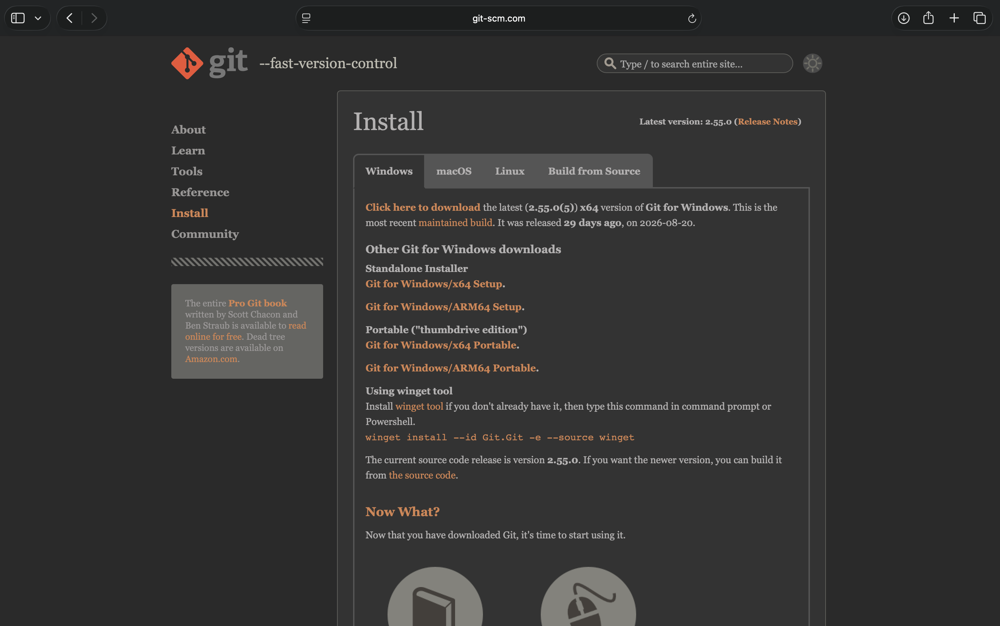
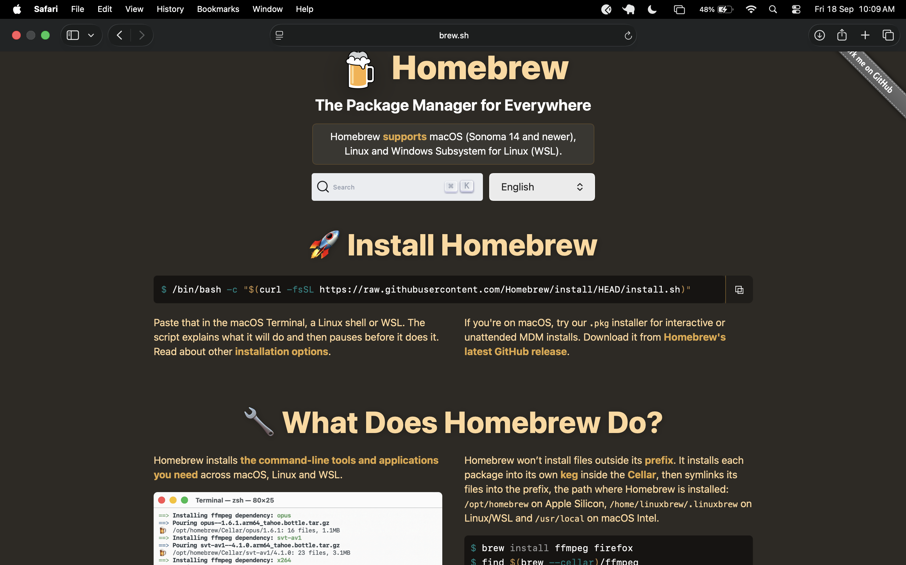

# 🛠️ Git & GitHub Workshop — Pre-Workshop Setup Manual

> **Please complete this BEFORE you arrive at the workshop.**  

---

## 📋 Table of Contents

1. [What You're Installing & Why](#1-what-youre-installing--why)
2. [Windows — Git Setup](#2-windows--git-setup)
3. [macOS — Git Setup](#3-macos--git-setup)
4. [Linux — Git Setup](#4-linux--git-setup)
5. [VS Code Setup (All Platforms)](#5-vs-code-setup-all-platforms)
6. [Python Setup (All Platforms)](#6-python-setup-all-platforms)
7. [Quick Reference Cheatsheet](#7-quick-reference-cheatsheet)
8. [Pre-Workshop Checklist](#8-pre-workshop-checklist)

---

## 1. What You're Installing & Why

| Tool | What it is | Why you need it |
|------|-----------|-----------------|
| **Git** | A version control system | Tracks changes to your code, lets you collaborate |
| **Homebrew** (Mac only) | A package manager for macOS | Makes installing developer tools like Git simple |
| **VS Code** | Code editor | Where you'll write code — we'll connect it to Git |
<<<<<<< HEAD
| **Python** | A programming language | Useful for scripting, automation, and open-source contributions |

=======
>>>>>>> 87c23a45f778d927415f5954167d1a17a3d19629
---

## 2. Windows — Git Setup

> 🎬 **Video walkthrough:** [How to Download & Install Git | Windows, Mac & Linux (Step by Step)](https://www.youtube.com/watch?v=lh-O3hZBqdQ)  
> 🎬 **Windows-only tutorial:** [How to Install Git on Windows | Full Guide](https://www.youtube.com/watch?v=VWbX2B3Q-1g)

---

### Step 1 — Download the installer

Go to: **[git-scm.com/download/win](https://git-scm.com/download/win)**

<<<<<<< HEAD
> 💡 **Note:** The current latest version is **Git 2.55.0** (released 2026-08-20). The page looks like this — click the top download link for the x64 Setup:
>
> 

=======
>>>>>>> 87c23a45f778d927415f5954167d1a17a3d19629
Click the link for "64-bit Git for Windows Setup."

---

### Step 2 — Run the installer

Double-click the downloaded `.exe` file. Click **Yes** on the security popup.

---

### Step 3 — Go through the installer (keep defaults)

The installer has many screens. Here's what to watch for:

| Screen | What to do |
|--------|-----------|
| License | Click **Next** |
| Select Destination | Keep default, click **Next** |
| Select Components | Keep defaults, click **Next** |
| Default Editor | Change to **Visual Studio Code** if you use it, else keep default |
| **Adjusting PATH** ⭐ | Select **"Git from the command line and also from 3rd-party software"** |
| HTTPS transport backend | Keep **"Use the OpenSSL library"**, click **Next** |
| Line ending conversions | Keep **"Checkout Windows-style, commit Unix-style"**, click **Next** |
| Terminal emulator | Keep **"Use MinTTY"**, click **Next** |
| Default behavior of `git pull` | Keep **"Default (fast-forward or merge)"**, click **Next** |
| Credential helper | Keep **"Git Credential Manager"**, click **Next** |
| Extra options | Keep defaults, click **Next** |
| Experimental options | Leave everything unchecked, click **Install** |

---

### Step 4 — Verify Git is installed

After install completes, open **Git Bash** (search for it in the Start menu) and run:

```bash
git --version
```

Expected output: `git version 2.x.x` ✅

---

### Step 5 — Configure Git

Git needs to know who you are before it can track your commits. Run these three commands in Git Bash, one at a time, replacing the placeholder text with your actual name and email:

```bash
git config --global user.name "Your Name"
```
```bash
git config --global user.email "you@example.com"
```
```bash
git config --global init.defaultBranch main
```

> Use the same email you use (or plan to use) for your GitHub account — this is how GitHub links your commits to your profile.

Then verify it worked:

```bash
git config --list
```

You should see your `user.name`, `user.email`, and `init.defaultBranch` in the output. ✅

---

### ⚠️ Common Issues — Windows

---

**❌ `git` is not recognised in Command Prompt after installation**

During setup, you may have chosen the wrong PATH option.

Fix — reinstall and select the right option:
1. Uninstall Git from Add/Remove Programs
2. Reinstall from [git-scm.com/download/win](https://git-scm.com/download/win)
3. On the "Adjusting your PATH environment" screen, select **"Git from the command line and also from 3rd-party software"**

Alternatively, use **Git Bash** instead of Command Prompt — it always works regardless of PATH.

---

**❌ Windows Defender or antivirus blocked the installer**

Right-click the `.exe` → **Properties** → check **"Unblock"** at the bottom → click OK → run again.

---

**❌ Git asks for username and password every time you push**

You need a credential helper. Git for Windows installs one by default — if it didn't activate:

```bash
git config --global credential.helper manager
```

---

**❌ Default branch shows as `master` instead of `main`**

```bash
git config --global init.defaultBranch main
```

This only affects new repositories going forward. Existing repos keep their branch name.

---

**❌ `git config --list` shows no user.name or user.email**

You skipped Step 5. Go back and run:

```bash
git config --global user.name "Your Name"
git config --global user.email "you@example.com"
```

---

## 3. macOS — Git Setup

> 🎬 **Video walkthrough:** https://www.youtube.com/watch?v=flQxyoyBX5M  
> 🎬 **Apple Silicon (M1/M2/M3/M4) specific:** [EASY Homebrew Installation on Apple Silicon](https://www.youtube.com/watch?v=4JMIfljw7GA)

---

### Step 1 — Open Terminal

Press **`Cmd + Space`** to open Spotlight Search, type **Terminal**, and hit Enter.

> Terminal is your command-line interface. Don't worry if it looks intimidating — you'll be using just a handful of commands.

---

### Step 2 — Install Homebrew

> 💡 **What is Homebrew?** It's the most popular package manager for macOS — think of it as an app store for developer tools that you control from the terminal. The official site looks like this:
>
> 
>
> Homebrew supports macOS (Sonoma 14 and newer), Linux, and WSL.

Paste the following command into Terminal and press **Enter**:

```bash
/bin/bash -c "$(curl -fsSL https://raw.githubusercontent.com/Homebrew/install/HEAD/install.sh)"
```

What happens next:

1. It will ask for your **Mac login password**. Type it and press Enter.  
   ⚠️ You won't see any characters as you type — that's completely normal. Just type your password and press Enter.

2. It will ask you to **press Enter** to confirm the installation. Do that.

3. It will download and install everything on its own. **This takes 2–5 minutes.** Don't close the terminal.

---

### Step 3 — Run the two post-install commands

When Homebrew finishes, it will display something like this at the bottom:

```
==> Next steps:
Run these two commands in your terminal to add Homebrew to your PATH:
    echo 'eval "$(/opt/homebrew/bin/brew shellenv)"' >> ~/.zprofile
    eval "$(/opt/homebrew/bin/brew shellenv)"
```

**Copy those two commands from YOUR terminal output** (not from here — they may differ slightly based on your Mac model) and run them one by one.

> ⚠️ This step is critical. Without it, your terminal won't recognise the `brew` command.

---

### Step 4 — Verify Homebrew installed correctly

```bash
brew --version
```

You should see something like: `Homebrew 4.x.x`

If you see that, Homebrew is working. ✅

---

### Step 5 — Install Git

```bash
brew install git
```

---

### Step 6 — Verify Git is installed

```bash
git --version
```

Expected output: `git version 2.x.x` ✅

---

### Step 7 — Configure Git

Git needs to know who you are before it can track your commits. Run these three commands in Terminal, one at a time:

```bash
git config --global user.name "Your Name"
```
```bash
git config --global user.email "you@example.com"
```
```bash
git config --global init.defaultBranch main
```

> Use the same email you use (or plan to use) for your GitHub account.

Then verify it worked:

```bash
git config --list
```

You should see your `user.name`, `user.email`, and `init.defaultBranch` in the output. ✅

---

### ⚠️ Common Issues — macOS

---

**❌ `brew: command not found` after installation**

You skipped or miscopied the two PATH commands after installation.

Fix:
```bash
echo 'eval "$(/opt/homebrew/bin/brew shellenv)"' >> ~/.zprofile
eval "$(/opt/homebrew/bin/brew shellenv)"
```
Close and reopen your terminal, then run `brew --version` again.

---

**❌ `curl: (7) Failed to connect` or network errors during Homebrew install**

Your internet connection dropped, or a firewall blocked the download.

Fix: Check your connection, disable VPN if you're using one, and re-run the install command. Homebrew will resume from where it left off.

---

**❌ Homebrew installer says "Xcode Command Line Tools" are missing**

This is normal on a fresh Mac. Homebrew will prompt to install them automatically. Just press **Enter** when it asks and wait — this can take 5–10 minutes on its own.

---

**❌ `git --version` still shows an old system version after `brew install git`**

macOS ships with an older built-in Git. Homebrew installs a newer one, but you may need to restart your terminal first. If it still shows the old version:

```bash
which git
```

If the output is `/usr/bin/git` instead of `/opt/homebrew/bin/git`, run:

```bash
echo 'export PATH="/opt/homebrew/bin:$PATH"' >> ~/.zprofile
source ~/.zprofile
```

---

**❌ `brew install git` says "already installed" but `git --version` shows old version**

```bash
brew upgrade git
```

---

**❌ `git config --list` shows no user.name or user.email**

You skipped Step 7. Go back and run:

```bash
git config --global user.name "Your Name"
git config --global user.email "you@example.com"
```

---

## 4. Linux — Git Setup

> This guide is for **Ubuntu / Debian-based** distributions (Ubuntu, Pop!_OS, Linux Mint, etc.).  
> If you're on Arch, Fedora, or another distro, use your respective package manager (`pacman -S git`, `dnf install git`, etc.).

---

### Step 1 — Open Terminal

Press **`Ctrl + Alt + T`** or search for "Terminal" in your app launcher.

---

### Step 2 — Update your package list

```bash
sudo apt update
```

You'll be asked for your password. Type it and press Enter.

> `sudo` means "run as administrator." It's normal — don't skip it.

---

### Step 3 — Install Git

```bash
sudo apt install git
```

When prompted `Do you want to continue? [Y/n]`, press **Y** and Enter.

---

### Step 4 — Verify Git is installed

```bash
git --version
```

Expected output: `git version 2.x.x` ✅

---

### Step 5 — Configure Git

Run these three commands in Terminal, one at a time:

```bash
git config --global user.name "Your Name"
```
```bash
git config --global user.email "you@example.com"
```
```bash
git config --global init.defaultBranch main
```

> Use the same email you use (or plan to use) for your GitHub account.

Then verify it worked:

```bash
git config --list
```

You should see your `user.name`, `user.email`, and `init.defaultBranch` in the output. ✅

---

### ⚠️ Common Issues — Linux

---

**❌ `sudo: command not found`**

You might be logged in as root already. Try running without `sudo`:

```bash
apt update && apt install git
```

---

**❌ `E: Unable to fetch some archives` or network errors**

```bash
sudo apt update --fix-missing
sudo apt install git
```

---

**❌ `Permission denied` errors**

Make sure you're using `sudo`. Without it, you don't have admin rights to install packages.

---

**❌ `git config --list` shows no user.name or user.email**

You skipped Step 5. Go back and run:

```bash
git config --global user.name "Your Name"
git config --global user.email "you@example.com"
```

---

**❌ Default branch shows as `master` instead of `main`**

```bash
git config --global init.defaultBranch main
```

---

## 5. VS Code Setup (All Platforms)

We'll be using VS Code as our editor during the workshop. This section covers three things:
1. Connecting VS Code to your terminal with `code .`
2. Installing GitLens

---

### Part A — Install VS Code

If you don't have VS Code yet, download it from **[code.visualstudio.com](https://code.visualstudio.com/)** and install it for your OS.

---

### Part B — Install the `code` command in Terminal

This lets you type `code .` in any terminal to instantly open that folder in VS Code.

#### Windows

The `code` command is added to PATH **automatically** during VS Code installation. Open Command Prompt or Git Bash and verify:

```bash
code --version
```

If it works, you're done. ✅

If it doesn't work, open VS Code manually, press `Ctrl + Shift + P`, type `shell command`, and select **"Shell Command: Install 'code' command in PATH"**. Then restart your terminal.

---

#### macOS

1. Open VS Code
2. Press **`Cmd + Shift + P`** to open the Command Palette
3. Type `shell command`
4. Click **"Shell Command: Install 'code' command in PATH"**
5. **Close your terminal completely and reopen it**

Now test it:

```bash
code --version
```

And open any folder:

```bash
code .
```

This should open that folder in VS Code instantly. ✅

---

#### Linux

Same as macOS — open VS Code, press **`Ctrl + Shift + P`**, type `shell command`, and click **"Shell Command: Install 'code' command in PATH"**. Restart your terminal and verify:

```bash
code --version
```

---

### Part C — Install GitLens

GitLens is a VS Code extension that makes Git history easier to understand. It shows inline blame, commit history, and branch activity directly in the editor, which is very useful during the workshop.

1. Open VS Code.
2. Click the **Extensions** icon in the left sidebar.
3. Search for **GitLens**.
4. Click **Install**.
5. If VS Code asks you to restart extensions, click **Restart Extensions**.


After installation, the GitLens marketplace page should look like this:


You can also install it from the terminal:

```bash
code --install-extension eamodio.gitlens
```

---

### Set VS Code as Git's default editor

Run this after the `code` command is working:

```bash
git config --global core.editor "code --wait"
```

---

### ⚠️ Common Issues — VS Code / `code .`

---

**❌ `code: command not found` on macOS or Linux**

You either skipped the Command Palette step or didn't restart your terminal. Close Terminal fully (not just the tab) and reopen it. If it still fails, redo the Command Palette step.

---

**❌ `code .` opens VS Code but in the wrong folder**

You're in the wrong directory. Use `cd` to navigate to the right folder first, then run `code .`.

---

**❌ `code --version` works but VS Code opens blank with no folder**

`code .` needs the `.` — that dot means "current folder." Without it, VS Code opens with no folder.

---

## 6. Python Setup (All Platforms)

> 💡 Python is used heavily in open-source projects. Having it set up means you can run scripts, install packages, and contribute to a much wider range of repos.

---

### Windows — Python Setup

#### Step 1 — Download the installer

Go to: **[python.org/downloads](https://www.python.org/downloads/)**

Click the yellow **"Download Python 3.x.x"** button (latest stable version).

---

#### Step 2 — Run the installer

Double-click the downloaded `.exe`.

> ⭐ **Critical:** On the first screen, check **"Add Python to PATH"** before clicking anything else. If you miss this, Python won't work from the terminal.

Then click **"Install Now"**.

---

#### Step 3 — Verify Python is installed

Open a new **Git Bash** or **Command Prompt** window and run:

```bash
python --version
```

Expected output: `Python 3.x.x` ✅

Also verify pip (Python's package manager) is installed:

```bash
pip --version
```

---

#### ⚠️ Common Issues — Windows Python

**❌ `python` is not recognised**

You forgot to check "Add Python to PATH" during installation.

Fix — reinstall and tick the box, or add it manually:
1. Search for **"Edit the system environment variables"** in the Start menu
2. Click **Environment Variables**
3. Under **System variables**, find **Path** and click **Edit**
4. Add the path to your Python install (usually `C:\Users\YourName\AppData\Local\Programs\Python\Python3xx\` and the `\Scripts\` subfolder)

**❌ `python` opens the Microsoft Store instead of running**

Windows has a stub that redirects to the Store. Fix it:
1. Search **"Manage app execution aliases"** in Settings
2. Turn off both **"python.exe"** and **"python3.exe"** aliases

---

### macOS — Python Setup

macOS may have an old Python 2 system install. We'll install a fresh Python 3 via Homebrew.

#### Step 1 — Install Python via Homebrew

```bash
brew install python
```

---

#### Step 2 — Verify Python is installed

```bash
python3 --version
```

Expected output: `Python 3.x.x` ✅

```bash
pip3 --version
```

> **Note:** On macOS with Homebrew, the commands are `python3` and `pip3` (not `python` / `pip`). This is intentional — it avoids conflicts with any system Python.

---

#### Step 3 — (Optional) Set `python` to point to Python 3

If you want to type `python` instead of `python3`:

```bash
echo 'alias python=python3' >> ~/.zprofile
echo 'alias pip=pip3' >> ~/.zprofile
source ~/.zprofile
```

---

#### ⚠️ Common Issues — macOS Python

**❌ `python3: command not found` after `brew install python`**

Restart your terminal. If it still fails, run:

```bash
brew link python
```

**❌ `pip3` installs packages but they can't be found**

Make sure you're running `python3` (not `python`) so you use the Homebrew version, not the system one.

---

### Linux — Python Setup

Most Linux distros come with Python 3 pre-installed. Let's check and install if needed.

#### Step 1 — Check if Python is already installed

```bash
python3 --version
```

If you see `Python 3.x.x`, you're done — skip to Step 3. ✅

---

#### Step 2 — Install Python if missing

```bash
sudo apt update
sudo apt install python3 python3-pip
```

When prompted `Do you want to continue? [Y/n]`, press **Y** and Enter.

---

#### Step 3 — Verify pip is installed

```bash
pip3 --version
```

Expected output: `pip x.x.x from ...` ✅

---

#### Step 4 — (Optional) Set `python` to point to Python 3

```bash
sudo apt install python-is-python3
```

This installs a small package that makes the `python` command point to `python3` system-wide.

---

#### ⚠️ Common Issues — Linux Python

**❌ `pip3: command not found`**

```bash
sudo apt install python3-pip
```

**❌ `externally-managed-environment` error when running `pip install`**

Ubuntu 23.04+ restricts system-level pip installs. Use a virtual environment instead:

```bash
python3 -m venv myenv
source myenv/bin/activate
pip install package-name
```

Or add `--break-system-packages` if you know what you're doing:

```bash
pip3 install package-name --break-system-packages
```

---

## 7. Quick Reference Cheatsheet

```bash
# ── Terminal Navigation ────────────────────────────────────
cd folder-name          # Enter a folder
cd ..                   # Go up one level
cd ~                    # Go to your home directory
ls                      # List files and folders (Mac/Linux)
ls -la                  # List all files including hidden ones (Mac/Linux)
dir                     # List files and folders (Windows CMD)
pwd                     # Print the full path of where you are now

# ── Installation Verification ──────────────────────────────
git --version           # Check Git version
brew --version          # Check Homebrew (Mac only)
code --version          # Check VS Code CLI
python --version        # Check Python (Windows)
python3 --version       # Check Python (Mac/Linux)
pip --version           # Check pip (Windows)
pip3 --version          # Check pip (Mac/Linux)

# ── Git Configuration ──────────────────────────────────────
git config --global user.name "Your Name"
git config --global user.email "you@example.com"
git config --global init.defaultBranch main
git config --global core.editor "code --wait"
git config --list       # View all your current config

# ── Open VS Code ───────────────────────────────────────────
code .                  # Open the current folder in VS Code
code filename.txt       # Open a specific file in VS Code

# ── GitLens via Terminal ───────────────────────────────────
code --install-extension eamodio.gitlens   # Install GitLens

# ── Python / pip ───────────────────────────────────────────
python3 -m venv myenv          # Create a virtual environment
source myenv/bin/activate      # Activate it (Mac/Linux)
myenv\Scripts\activate         # Activate it (Windows)
pip install package-name       # Install a Python package
pip list                       # List installed packages
deactivate                     # Exit the virtual environment
```

---

## 8. Pre-Workshop Checklist

Before you show up, make sure you can tick all of these:

- [ ] `git --version` returns a version number
- [ ] `git config --list` shows your name and email
- [ ] `code .` opens VS Code from the terminal
- [ ] You have a [GitHub account](https://github.com) (create one if you don't)
- [ ] GitLens is installed — you can see inline blame text when you open a file in a Git repo
- [ ] `python3 --version` (Mac/Linux) or `python --version` (Windows) returns a version number
- [ ] `pip3 --version` (Mac/Linux) or `pip --version` (Windows) works

---

> **Questions?** Drop a message in the workshop group or reach out before the session.  
> See you there! 🚀
