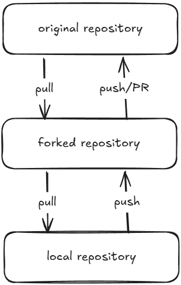

# Git: Branches and Merging

This section demonstrates how to work with a forked repository, create and manage feature branches, switch between branches, make different versions of the same change, merge them back into `main`, and resolve a merge conflict.

## Index

- [Step 1: Forked Repository vs Standard Repository](#step-1-forked-repository-vs-standard-repository)
- [Step 2: Fork and Clone the Repository](#step-2-fork-and-clone-the-repository)
- [Step 3: Add the Upstream Remote](#step-3-add-the-upstream-remote)
- [Step 4: Create and Manage Branches](#step-4-create-and-manage-branches)
- [Step 5: Make Changes on Branch 2](#step-5-make-changes-on-branch-2)
- [Step 6: Switch to Branch 1 and Make a Different Change](#step-6-switch-to-branch-1-and-make-a-different-change)
- [Step 7: Switch Back to `main`](#step-7-switch-back-to-main)
- [Step 8: Cleanly Merge Branch 1](#step-8-cleanly-merge-branch-1)
- [Step 9: Merge Branch 2 and Trigger a Conflict](#step-9-merge-branch-2-and-trigger-a-conflict)
- [Step 10: Understanding the Conflict Markers](#step-10-understanding-the-conflict-markers)
- [Step 11: Four Ways to Resolve a Merge Conflict](#step-11-four-ways-to-resolve-a-merge-conflict)
- [Step 12: Mark the Conflict as Resolved](#step-12-mark-the-conflict-as-resolved)
- [Step 13: Cleanup](#step-13-cleanup)
- [Full Flow](#full-flow)
- [Quick Reference](#quick-reference)
- [Key Takeaways](#key-takeaways)

---

## Step 1: Forked Repository vs Standard Repository

A **standard repository workflow** usually means you clone a repository that you already have direct access to and push your branches back to that same repository.

A **forked repository workflow** creates your own copy of someone else's GitHub repository under your account. You normally push your work to your fork (`origin`) while keeping the original repository (`upstream`) connected so that you can fetch updates from it.



### Key difference

| Forked repository | Standard repository |
| :--- | :--- |
| You create your own GitHub copy of the original repository. | You work directly with the repository you have access to. |
| `origin` normally points to your fork. | `origin` normally points to the main project repository. |
| `upstream` can point to the original project. | An `upstream` remote is usually unnecessary unless another source repository is involved. |
| Your changes can be pushed to your fork before being proposed to the original project. | Your changes can be pushed directly if you have permission. |

---

## Step 2: Fork and Clone the Repository

After forking the repository on GitHub, clone **your fork** to your computer.

```bash
git clone https://github.com/<your-username>/<repository>.git
```
```bash
git clone https://github.com/aditiakansha/super_calculator.git
```

The `git clone` command creates a local Git repository and automatically sets the cloned GitHub repository as the `origin` remote.

---

## Step 3: Add the Upstream Remote

The fork is your copy of the project, but you may still need a connection to the **original** repository so that you can fetch its changes.

```bash
git remote add upstream https://github.com/<original-owner>/<repository>.git
git remote 
```

```bash
git remote add upstream https://github.com/aditiakansha/super_calculator.git
git remote 
```

After this, the repository has two important remote names:

- **`origin`**: your fork, where your work normally gets pushed.
- **`upstream`**: the original repository, used to obtain updates from the source project.

To download information from the original repository without changing your working files, run:

```bash
git fetch upstream
```

`git fetch upstream` downloads the upstream branch information and creates or updates remote-tracking references such as `upstream/main`. It does not automatically merge those changes into your current branch.

---

## Step 4: Create and Manage Branches

Branches let you work on separate versions of the project without changing `main` until you are ready to merge the work.

### Branch 1

For the demonstrated workflow, branch #1 was created with:

```bash
git branch <feature-branch>
git branch
```
```bash
git branch feat/subtraction#1
git branch
```

### Branch 2

The second branch was created with `git checkout -b`, which creates the branch and immediately switches to it.

```bash
git checkout -b <another-feature-branch>
```

```bash
git checkout -b feat/subtraction#2
```

### `git branch` vs `git checkout`

| Command | What it does |
| :--- | :--- |
| `git branch <name>` | Creates the branch but keeps you on the current branch. |
| `git checkout <branch>` | Switches your working context to an existing branch. |
| `git checkout -b <name>` | Creates a new branch and switches to it immediately. |
| `git switch <branch>` | Modern command for switching to an existing branch. |
| `git switch -c <name>` | Modern command for creating and switching to a new branch. |

---

## Step 5: Make Changes on Branch 2

While on `<another-feature-branch>`, a subtraction function was added to `calc.py`.

The implementation used in this branch is the simple version:

```python
def subtraction(a, b):
    return a - b
```

After saving the file, the change was committed:

```bash
git commit -am "added a simple subtraction function"
```

This creates a commit containing the implementation on the current branch.

---

## Step 6: Switch to Branch 1 and Make a Different Change

Now switch from the second branch to the first branch.

The modern command is:

```bash
git switch <feature-branch>
```

```bash
git switch feat/subtraction#1
```

The same operation can also be performed with:

```bash
git checkout <feature-branch>
```

On the first branch, the subtraction function was implemented with explicit floating-point type annotations:

```python
def subtraction(a: float, b: float) -> float:
    return a - b
```

The change was then committed:

```bash
git commit -am "added a subtraction function using float"
```

At this point, the two branches contain different implementations of the same function. This is what creates the conflict that will appear during the later merge.

---

## Step 7: Switch Back to `main`

Before merging, return to the main branch:

```bash
git checkout main
```

You are now on `main`, so merges will apply their changes into `main`.

---

## Step 8: Cleanly Merge Branch 1

The first feature branch can be merged into `main`:

```bash
git merge <feature-branch>
```

```bash
git merge feat/subtraction#2
```

This merge succeeds cleanly because the changes from branch #1 do not overlap with another competing change in the version of `main` being merged at this point.

After the merge, `main` contains the float-based subtraction function from `<feature-branch>`.

---

## Step 9: Merge Branch 2 and Trigger a Conflict

Now try to merge the second feature branch:

```bash
git merge <another-feature-branch>
```

```bash
git merge feat/subtraction#1
```

Git reports a conflict because both branches changed the same area of `calc.py` in different ways.

When this happens, Git cannot safely decide which version should become the final code. The file is therefore marked as conflicted and must be resolved manually.

---

## Step 10: Understanding the Conflict Markers

VS Code shows the conflicting area using markers like these:

```text
<<<<<<< HEAD
# Current change from the branch you are merging into
=======
# Incoming change from the branch being merged
>>>>>>> <another-feature-branch>
```

In this demonstration, the conflict is between the float-typed version on `main` and the simpler version from `<another-feature-branch>`.

---

## Step 11: Four Ways to Resolve a Merge Conflict

There are four practical approaches shown by the VS Code merge-conflict editor.

### 1. Accept Current Change

Choose **Accept Current Change** when you want to keep the version already present on the branch you are currently merging into.

For this example, that keeps:

```python
def subtraction(a: float, b: float) -> float:
    return a - b
```

The incoming version is discarded for that conflict region.

**Use this when:** the current branch's implementation is the one you want to preserve.

### 2. Accept Incoming Change

Choose **Accept Incoming Change** when you want the version coming from the branch being merged.

For this example, that keeps:

```python
def subtraction(a, b):
    return a - b
```

The current version of that conflict region is discarded.

**Use this when:** the incoming branch contains the implementation you want instead.

### 3. Accept Both Changes

Choose **Accept Both Changes** when both pieces of code are useful and you want to keep them in the resulting file.

In this particular Python example, keeping both definitions with the same function name is usually **not** the final solution, because the later `subtraction()` definition replaces the earlier one when Python runs the file.

So accepting both is useful only when both pieces can coexist meaningfully, or when you plan to edit the result afterward.

**Use this when:** both changes are genuinely needed and can be combined safely.

### 4. Change the Whole Thing Manually

Instead of accepting one of the predefined choices, you can rewrite the conflicted section yourself.

For example, you could decide that the final implementation should simply be:

```python
def subtraction(a: float, b: float) -> float:
    return a - b
```

Then remove the conflict markers and any unwanted code manually.

This is the most flexible option because you are not limited to choosing one side or blindly keeping both sides.

**Use this when:** the correct result needs a custom combination or a completely new implementation.

---

## Step 12: Mark the Conflict as Resolved

After editing `calc.py`, make sure no conflict markers such as `<<<<<<<`, `=======`, or `>>>>>>>` remain in the file.

Then stage the resolved file:

```bash
git add calc.py
```

Once the file is staged, complete the merge with a commit:

```bash
git commit -m "resolve merge conflict"
```

At this point, the merge is completed and `main` contains the final version you chose during conflict resolution.

---

## Step 13: Cleanup

Once both feature branches have been merged and are no longer needed, remove them:

```bash
git branch -D <feature-branch>
git branch -D <another-feature-branch>
```

```bash
git branch -D feat/subtraction#1
git branch -D feat/subtraction#2
```

`-D` forces branch deletion. In this demonstration the branches have already been merged into `main`, so the deletion removes the local branch names while keeping the commits that are part of the repository history.

---

## Full Flow

Replace each angle-bracket placeholder with a value from your own repository before running the commands.

```bash
# Clone your fork
git clone https://github.com/<your-username>/<repository>.git

# Add the original repository as upstream
git remote add upstream https://github.com/<original-owner>/<repository>.git
git fetch upstream

# Create a branch without switching to it
git branch <feature-branch>

# Create and switch to another branch
git checkout -b <another-feature-branch>

# Work on branch #2
git commit -am "added a simple subtraction function"

# Switch to the first branch
git switch <feature-branch>

# Work on branch #1
git commit -am "added a subtraction function using float"

# Return to main
git checkout main

# Merge the first branch cleanly
git merge <feature-branch>

# Merge the second branch, which causes a conflict
git merge <another-feature-branch>

# Resolve calc.py manually, then stage and commit
git add calc.py
git commit -m "resolve merge conflict"

# Cleanup
git branch -D <feature-branch>
git branch -D <another-feature-branch>
```

---

## Quick Reference

| What you want to do | Command |
| :--- | :--- |
| Clone your fork | `git clone <url>` |
| Add original repository as upstream | `git remote add upstream <url>` |
| Download upstream changes | `git fetch upstream` |
| List local branches | `git branch` |
| Create a branch without switching | `git branch <name>` |
| Copy an existing branch | `git branch -c <new-name>` |
| Switch branches | `git switch <branch>` |
| Switch branches with checkout | `git checkout <branch>` |
| Create + switch branch | `git checkout -b <branch>` |
| Modern create + switch | `git switch -c <branch>` |
| Merge a branch | `git merge <branch>` |
| Force-delete a local branch | `git branch -D <branch>` |

---

## Key Takeaways

A fork gives you your own copy of a project while `upstream` keeps you connected to the original repository. Branches isolate work, and merging brings that work back together. When two branches modify the same part of a file differently, Git stops and asks you to decide what the final code should be. The conflict editor can keep the current change, keep the incoming change, keep both, or let you rewrite the result manually.
