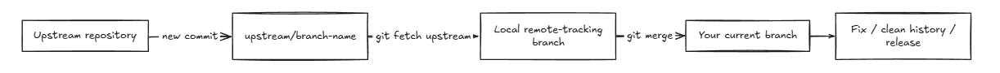

# Git: Workflows, History & Release Management

This section demonstrates how to work with changes arriving from an upstream repository, inspect earlier commits, undo incorrect changes in different ways, rewrite local history when necessary, rebase a feature branch, cherry-pick a specific commit, and tag a final release.

## Index

- [Step 1: Background and An Incorrect Upstream Change](#step-1-background-and-an-incorrect-upstream-change)
- [Step 2: Fetch and Merge an Upstream Branch](#step-2-fetch-and-merge-an-upstream-branch)
- [Step 3: Inspect an Earlier Commit with `git checkout`](#step-3-inspect-an-earlier-commit-with-git-checkout)
- [Step 4: Revert an Incorrect Commit](#step-4-revert-an-incorrect-commit)
- [Step 5: Reset the Branch and Force Push](#step-5-reset-the-branch-and-force-push)
- [Step 6: Correct the Work and Use `git reset --soft`](#step-6-correct-the-work-and-use-git-reset---soft)
- [Step 7: Switch to `main` and Rebase](#step-7-switch-to-main-and-rebase)
- [Step 8: Cherry-Pick a Specific Commit](#step-8-cherry-pick-a-specific-commit)
- [Step 9: Push and Tag the Final Version](#step-9-push-and-tag-the-final-version)
- [Full Flow](#full-flow)
- [Quick Reference](#quick-reference)
- [Key Takeaways](#key-takeaways)

---

## Step 1: Background and An Incorrect Upstream Change

For this demonstration, assume a team member has committed an incorrect change to a new branch on the upstream repository.

The important idea is that the change exists on the upstream repository, but it has not yet been integrated into your local branch.



This gives us a realistic situation for practising history-management commands: first bring the remote work into view, then decide how it should be incorporated or undone.

---

## Step 2: Fetch and Merge an Upstream Branch

### Fetch the upstream changes

The first step is to fetch the changes from the upstream repository.

```bash
git fetch upstream
```

The fetch shown above discovers a new branch and records it locally as `upstream/<branch-name>`. Fetching does **not** automatically change the files in your current working branch.

For a specific upstream branch, the same idea can be written as:

```bash
git fetch upstream <branch-name>
```

### Create a local branch from the upstream branch

The demonstration then creates a local branch that tracks the upstream branch:

```bash
git checkout -b <local-branch> upstream/<branch-name>
```

This creates the local branch and immediately switches to it. The local branch is also configured to track the upstream branch.

### Merge the upstream branch

When you are already on the branch that should receive the upstream work, the merge operation is:

```bash
git merge upstream/<branch-name>
```

Replace `<branch-name>` with the name of the upstream branch you want to merge.

`git merge` takes the commits reachable from the specified branch and integrates them into the currently checked-out branch.

---

## Step 3: Inspect an Earlier Commit with `git checkout`

`git checkout` is commonly used for switching branches, but it can also be used with a **commit hash** to inspect the repository at an earlier point in history.

```bash
git checkout <commit-hash>
```

When you check out a commit directly, Git places you in a **detached HEAD** state. You are looking at that exact commit rather than working on the tip of a branch.

This is useful for:

- inspecting how the project looked at an older point in time;
- testing or comparing an earlier version;
- checking whether a particular commit introduced a problem.

It is not the same as moving a branch pointer. If you make commits in detached HEAD and want to keep them, you should create a branch for them.

To return to the previous branch, switch back to it explicitly, for example:

```bash
git checkout <branch-name>
```

---

## Step 4: Revert an Incorrect Commit

Suppose the incorrect commit should be undone, but the branch is already shared or pushed.

Use `git revert`:

```bash
git revert <commit-hash>
```

`git revert` does **not** erase the old commit. Instead, it creates a **new commit whose changes reverse the selected commit**.

This is useful when the existing history should remain visible and you want the correction to be represented as another commit.

Example:

```text
A --- B --- C        original history
                     R        revert commit
```

After the revert, the bad commit `C` still exists in history, but `R` reverses its effect.

---

## Step 5: Reset the Branch and Force Push

Sometimes the goal is different: instead of adding another commit that undoes the mistake, you want the branch itself to move back to an earlier commit.

Use:

```bash
git reset --hard <commit-hash>
```

`git reset --hard <commit-hash>` moves the current branch pointer to the selected commit and also makes the index and working tree match that commit.

This is a destructive operation for changes that exist only after the reset point. Make sure the commit you are resetting to is the one you actually want.

### Why did normal `git push` fail?

After a hard reset, your local branch can be **behind the remote branch in history**, even though your local branch now contains the history you want. A normal push is rejected because Git would have to move the remote branch backward instead of doing a fast-forward update.

That is why the demonstration uses:

```bash
git push --force
```

Force push tells the remote to accept the rewritten branch history.

> **Important:** `git push --force` can overwrite commits that other people have pushed. It should be used only when you intentionally want to rewrite the remote branch history. On shared branches, this can disrupt other people's work.

---

## Step 6: Correct the Work and Use `git reset --soft`

A different situation is when the code has been corrected locally and you want to **remove an unwanted commit from the visible history while keeping the changes staged**, so they can be combined into one clean commit.

Use:

```bash
git reset --soft <commit-hash>
```

Unlike `--hard`, a soft reset keeps the changes from the removed commits in the staging area.

That makes it possible to:

1. move the branch pointer back to the desired earlier commit;
2. keep the corrected file changes staged;
3. create one new commit containing the cleaned-up result.

The demonstration then creates a replacement commit:

```bash
git commit -m "added a simple power function"
```

and pushes the rewritten history with:

```bash
git push --force
```

### `--soft` vs `--hard`

| Command | Branch pointer | Staged changes | Working files |
| :--- | :--- | :--- | :--- |
| `git reset --soft <commit>` | Moved | Kept staged | Kept |
| `git reset --hard <commit>` | Moved | Discarded to match commit | Reset to match commit |

The key difference is that `--soft` is useful when you want to **rewrite the commit history but preserve the work**, while `--hard` is used when you also want the working directory reset to the target commit.

---

## Step 7: Switch to `main` and Rebase

After cleaning up the feature history, switch to `main`:

```bash
git switch main
```

Then, from the feature branch you want to update, run:

```bash
git rebase main
```

`git rebase main` takes the commits on the current branch and re-applies them on top of the current tip of `main`.

Conceptually:

```text
Before:

main:    A --- B --- C
                \
feature:          D --- E

After rebase:

main:    A --- B --- C
                      \
feature:                D' --- E'
```

The rebased commits have new commit identities because Git is replaying them onto a different base.

If a rebase produces a conflict, Git pauses and asks you to resolve it before continuing with:

```bash
git add <resolved-file>
git rebase --continue
```

A rebase can rewrite commit history, so pushing a branch that has already been published may require a force push afterward.

---

## Step 8: Cherry-Pick a Specific Commit

`git cherry-pick` is useful when you want **one particular commit** from another branch without merging the entire branch.

```bash
git cherry-pick <commit-hash>
```

For example, imagine another branch contains three commits:

```text
A --- B --- C --- D --- E
          ^
       useful fix
```

You can switch to the branch that needs the fix and cherry-pick only commit `C`:

```bash
git switch main
git cherry-pick <commit-hash-of-C>
```

Git creates a new commit on `main` containing the changes introduced by that commit.

This is different from `git merge`:

| Command | What it brings in |
| :--- | :--- |
| `git merge <branch>` | Integrates the branch's history into the current branch. |
| `git cherry-pick <commit>` | Applies one selected commit to the current branch. |

Cherry-picking is useful for bringing over a focused bug fix or a small feature without integrating everything from the source branch.

---

## Step 9: Push and Tag the Final Version

Once the history is corrected and the desired changes are present, push the branch:

```bash
git push origin <branch-name>
```

Finally, create a tag for the release point.

The demonstration uses an **annotated tag**:

```bash
git tag -a v1.0.0 -m "Released alpha version"
```

An annotated tag stores the tag name together with a message and tag metadata. It gives the selected commit a clear release label such as `v1.0.0`.

Push the tag to GitHub with:

```bash
git push origin v1.0.0
```

The tag now exists on the remote repository and marks that exact commit as the release point.

---

## Full Flow

Replace placeholders with the branch names and commit hashes used in your repository.

```bash
# Fetch changes from the original repository
git fetch upstream

# Create a local branch from the upstream branch
git checkout -b <local-branch> upstream/<branch-name>

# Merge a specific upstream branch when required
git merge upstream/<branch-name>

# Inspect an older commit
git checkout <commit-hash>
git checkout <branch-name>

# Safely undo a public/shared commit with a new commit
git revert <commit-hash>

# Rewrite branch history and move back to an earlier commit
git reset --hard <commit-hash>
git push --force

# Keep corrected changes staged while rewriting the history
git reset --soft <commit-hash>
git commit -m "describe your corrected changes"
git push --force

# Move to main and rebase the current feature branch onto it
git switch main
git switch <feature-branch>
git rebase main

# Apply one specific commit
git cherry-pick <commit-hash>

# Push final work
git push origin <branch-name>

# Tag the release and push the tag
git tag -a v1.0.0 -m "Released alpha version"
git push origin v1.0.0
```

---

## Quick Reference

| What you want to do | Command |
| :--- | :--- |
| Fetch everything from upstream | `git fetch upstream` |
| Fetch one upstream branch | `git fetch upstream <branch>` |
| Create + switch from an upstream branch | `git checkout -b <local> upstream/<branch>` |
| Merge an upstream branch | `git merge upstream/<branch>` |
| Inspect an old commit | `git checkout <commit-hash>` |
| Undo a commit with a new commit | `git revert <commit-hash>` |
| Move branch and discard later changes | `git reset --hard <commit>` |
| Move branch but keep changes staged | `git reset --soft <commit>` |
| Force-push rewritten history | `git push --force` |
| Switch to `main` | `git switch main` |
| Rebase current branch onto `main` | `git rebase main` |
| Apply one commit only | `git cherry-pick <commit>` |
| Create an annotated release tag | `git tag -a <tag> -m "message"` |
| Push a tag | `git push origin <tag>` |

---

## Key Takeaways

`git fetch` lets you inspect upstream work before integrating it. `git merge` combines histories, while `git checkout <commit>` lets you inspect an earlier state of the repository through detached HEAD mode. `git revert` undoes a commit by creating another commit, whereas `git reset --hard` and `git reset --soft` move the branch pointer and are mainly used when rewriting local history. `git push --force` is needed when the rewritten local history must replace the remote history. `git rebase` replays your work on top of another base, `git cherry-pick` applies one chosen commit, and `git tag` gives a release point a clear name.
